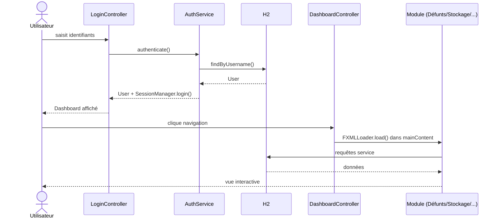
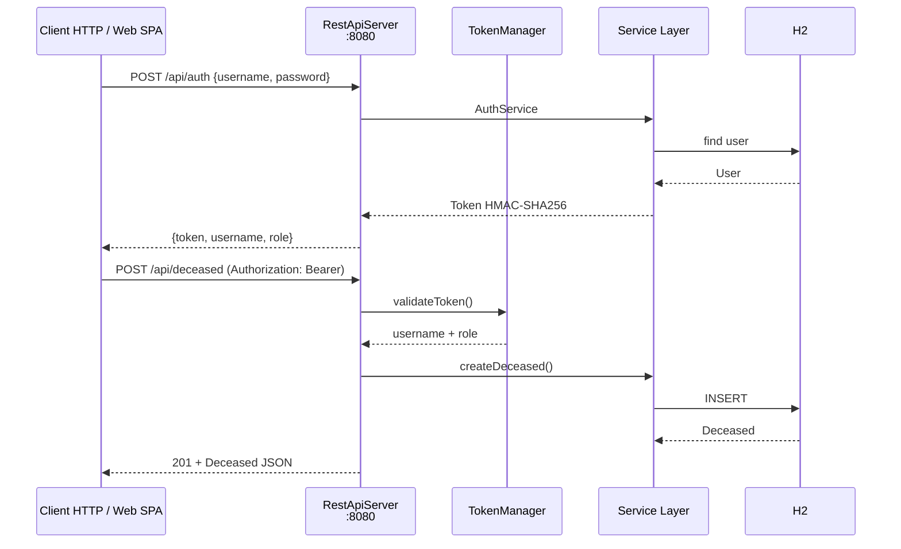
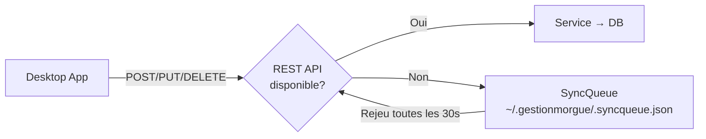
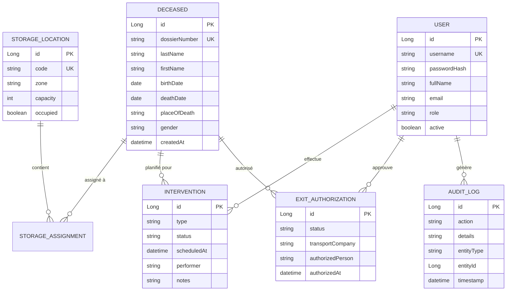

# Architecture — Gestion Morgue

## Stack

| Couche | Technologie |
|---|---|
| Langage | Java 17+ |
| UI | JavaFX 17+ (FXML + CSS) |
| Persistance | JPA / Hibernate 5.6 + H2 embarqué (PostgreSQL optionnel) |
| Build | Maven (fat JAR) |
| REST API | `com.sun.net.httpserver` (JDK natif) |
| Auth | HMAC-SHA256 (token maison, pas de JWT externe) |
| PDF | OpenPDF (iText fork) |
| Tests | JUnit 5 + TestFX + HttpClient JDK |

## Diagramme des couches

```mermaid
graph TB
    subgraph "UI Layer"
        FXML[FXML Views]
        CTRL[Controllers]
        CSS[Styles (clair/sombre)]
    end
    subgraph "Service Layer"
        SV[Services<br/>DeceasedService<br/>StorageService<br/>InterventionService<br/>ExitService<br/>AuthService<br/>ReportService<br/>BackupService<br/>AuditService<br/>LabelService]
    end
    subgraph "Persistence Layer"
        DAO[GenericDao + DAOs spécialisés]
        JPA[Entités JPA<br/>Deceased, StorageLocation<br/>Intervention, ExitAuthorization<br/>User, AuditLog]
        DB[(H2 / PostgreSQL)]
    end
    subgraph "REST API Layer"
        API[RestApiServer<br/>6 endpoints]
        TOKEN[TokenManager<br/>HMAC-SHA256]
        METRICS[MetricsCollector<br/>JSON + OpenMetrics]
        WEB[Web Interface<br/>index.html + SPA]
    end
    subgraph "Infrastructure"
        CONF[ConfigService<br/>JSON persistant]
        I18N[I18nUtil<br/>fr/en]
        SYNC[SyncQueue<br/>file offline JSON]
        LOG[Logback<br/>rolling 30 jours]
    end

    FXML --> CTRL
    CTRL --> SV
    SV --> DAO
    DAO --> JPA
    JPA --> DB
    API --> SV
    API --> TOKEN
    API --> METRICS
    API --> WEB
```

## Parcours utilisateur



## Flux API REST



## Routes API

| Méthode | Route | Auth | Description |
|---|---|---|---|
| GET | `/api/health` | Non | Healthcheck |
| GET | `/api/metrics` | Bearer | Métriques JSON ou OpenMetrics |
| POST | `/api/auth` | Non | Login → token |
| GET | `/api/deceased` | Non | Liste défunts |
| GET | `/api/deceased/{id}` | Non | Défunt par ID |
| POST | `/api/deceased` | Bearer | Créer défunt |
| PUT | `/api/deceased/{id}` | Bearer | Modifier défunt |
| DELETE | `/api/deceased/{id}` | Bearer | Supprimer défunt |
| GET | `/api/storage` | Non | Emplacements stockage |
| GET | `/api/interventions` | Non | Interventions en attente |
| GET | `/api/syncqueue` | Bearer | File d'attente offline |
| DELETE | `/api/syncqueue` | Bearer | Vider la file |

## Offline mode (SyncQueue)



## Schéma BDD (entités principales)



## Règles métier

- **NIR** : validation 13 ou 15 chiffres + clé de contrôle (ValidationUtil)
- **Permissions** : ADMIN seul peut gérer les utilisateurs ; ADMIN + MEDECIN peuvent approuver les sorties
- **Dossier** : format `DOS-YYYY-NNNN` (auto-incrément)
- **Stockage** : un défunt peut avoir plusieurs assignations historiques
- **Sortie** : cycle `PENDING → APPROUVEE → SORTIE_EFFECTUEE`
- **Audit** : chaque modification significative est loguée automatiquement

## Tests

| Type | Technologie | Nombre |
|---|---|---|
| Unitaires | JUnit 5 | ~30 |
| UI (TestFX) | TestFX 4 | ~35 |
| Intégration REST | HttpClient JDK | 14 |
| SyncQueue | JUnit 5 | 3 |
| **Total** | | **~95** |

## Déploiement

```bash
# Desktop
mvn clean package -DskipTests
java -jar target/gestionmorgue-1.0.0.jar --db=h2 --api-port=8080

# Docker
docker-compose up -d
# → App JavaFX (nécessite X11/GTK)
# → REST API : http://localhost:8080
# → Web SPA  : http://localhost:8080/index.html
# → OpenAPI  : http://localhost:8080/openapi.yaml
```

## Configuration

| Fichier | Emplacement | Description |
|---|---|---|
| Base H2 | `~/.gestionmorgue/db/gestionmorgue` | Base embarquée |
| Logs | `~/.gestionmorgue/logs/app.log` | Rotation quotidienne (30j) |
| Config | `~/.gestionmorgue/config.json` | Thème, langue, préférences |
| Backup | `~/.gestionmorgue/backups/*.sql` | Sauvegardes SQL |
| SyncQueue | `~/.gestionmorgue/.syncqueue.json` | File offline |
